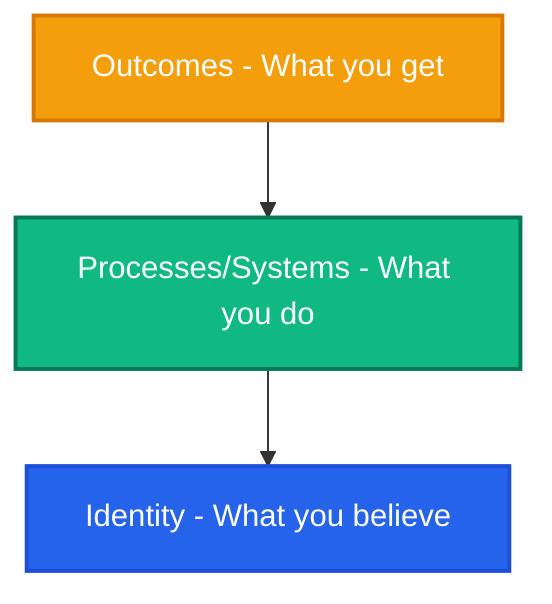

# Atomic Habits System Tracker: Identity & Process Specification

## Introduction: The Philosophy of System-Driven Change

Most habit trackers fail because they are built around **outcomes** rather than **identity** and **systems**. They ask: *"What goal do you want to achieve?"* (e.g., lose 10kg, write a book, read 20 pages a day) and track checklists.

Inspired by James Clear's *Atomic Habits*, this specification establishes a design framework for **AtomicTracker**—a tracker where habits are not isolated checklists but **systemic votes for your desired identity**.



### The Three Layers of Behavior Change
1. **Outcomes (The Outer Layer):** Concerned with changing your results.
2. **Processes / Systems (The Middle Layer):** Concerned with changing your habits and routines.
3. **Identity (The Deep Core):** Concerned with changing your beliefs, self-image, and judgments about yourself.

**The Golden Rule:** The ultimate form of intrinsic motivation is when a habit becomes part of your identity. *It’s one thing to say, "I am the type of person who wants this." It is something quite different to say, "I am the type of person who is this."*

---

## Pillar 1: The Identity Paradigm (Who vs. What)

In this framework, habits do not exist in a vacuum; they belong to an **Identity**. Every action is a vote cast for that identity.

```
                  +----------------------------------+
                  |  CORE IDENTITY: "I am a Writer"  |
                  +-----------------+----------------+
                                    |
            +-----------------------+-----------------------+
            | (reinforces)                                  | (reinforces)
  +---------v---------+                           +---------v---------+
  |  Positive Habit:  |                           |  Positive Habit:  |
  | Write 100 words   |                           | Read 15 mins      |
  +---------+---------+                           +---------+---------+
            | (casts vote)                                  | (casts vote)
            |                                               |
            +----------------------> [VOTING BOX] <----------+
                                         |
                                         v
                            +------------+-----------+
                            | Current Vote Tally: 84 |
                            +------------------------+
```

### 1. The Core Mechanic: Voting
- **Good Habits** are positive votes cast. Completing a good habit adds a vote (evidence) to that specific identity.
- **Bad Habits** (anti-habits) are negative votes. Relapsing or engaging in a bad habit subtracts a vote or adds a counter-vote (counter-evidence).
- **Identity Strength Score:** Rather than streaks, the primary metric is the **Identity Strength Score (%)**, computed as:
  $$\text{Identity Strength} = \frac{\text{Positive Votes Cast}}{\text{Positive Votes Cast} + \text{Bad Habit Relapses}} \times 100$$
  This matches James Clear's insight: *You don't need a perfect score to win an election; you just need a majority of the votes.*

### 2. Identity Discovery and onboarding
Before a user creates a habit, they must declare their target identity.
- **Formulation:** "I want to become the type of person who is..." (e.g., "An Athlete", "A Scholar", "A Creative writer", "A Mindful thinker").
- **Identity Card:** Visual representation of the identity, displaying its Level (based on total votes), current Strength Score, and a log of recent evidence.

---

## Pillar 2: The Systems Model (How vs. Outcomes)

Systems are the repeatable workflows that lead to the identity. In AtomicTracker, a habit is defined by its *System Components* rather than its target output.

### 1. Habit Configuration Elements (The Blueprint)
Every habit registered in the system requires mapping to the **4 Laws of Behavior Change**:

| Law | Concept | Field in App | Description / Example |
| :--- | :--- | :--- | :--- |
| **1st Law** | Make it Obvious | **Implementation Intention** | *"I will [Behavior] at [Time] in [Location]."* |
| | | **Habit Stack** | *"After [Current Habit], I will [New Habit]."* |
| **2nd Law** | Make it Attractive | **Temptation Bundle** | Link a *need* with a *want* (e.g., "While walking on the treadmill (need), I will listen to my favorite podcast (want)"). |
| **3rd Law** | Make it Easy | **The Two-Minute Rule** | A simplified, starter version of the habit (e.g., "Open textbook and read one page"). |
| | | **Environment Prep** | Action to prime the space (e.g., "Set out running clothes the night before"). |
| **4th Law** | Make it Satisfying | **Immediate Reward** | Immediate positive reinforcement (e.g., "Marking off checklist with sound effect + 5 mins of play"). |

### 2. The "Never Miss Twice" Rule
- Standard trackers penalize streaks heavily on a single miss. AtomicTracker enforces the **"Never Miss Twice"** philosophy.
- **Logic:** Missing once is an accident. Missing twice is the start of a new bad habit.
- **UI Safeguard:** If a habit is missed today, the UI highlights it tomorrow in amber/red warning states with the prompt: *“Yesterday was a slip. Protect your identity today: execute the 2-Minute version now to keep your streak!”*

---

## Pillar 3: Environment Design (Friction Control)

Environment is the invisible hand that shapes human behavior. The AtomicTracker spec separates environment configuration into **Engines** and **Brakes**.

```
                           ENVIRONMENT STIMULI
                                    |
            +-----------------------+-----------------------+
            |                                               |
  +---------v---------+                           +---------v---------+
  |    THE ENGINES    |                           |    THE BRAKES     |
  | (Friction Reduction)                          | (Friction Addition) |
  |   For Good Habits                             |   For Bad Habits    |
  +---------+---------+                           +---------+---------+
            | (example)                                     | (example)
            |                                               |
  "Keep yoga mat rolled                           "Place phone in a    |
   out in the living room"                         drawer in another    |
                                                   room during focus"   |
```

### 1. The Engine (For Good Habits)
- **Objective:** Reduce friction and make cues highly visible.
- **Spec:** Users link specific environmental cues to their good habits.
- *Example:* "I want to practice guitar." -> *Engine strategy:* "Put the guitar in the middle of the living room."

### 2. The Brakes (For Bad Habits)
- **Objective:** Increase friction and make cues invisible.
- **Spec:** Users map environment rules to block their bad habits.
- *Example:* "I want to stop scrolling social media before bed." -> *Brakes strategy:* "Leave the charger in the kitchen. No phones in the bedroom."

---

## Pillar 4: The 4 Laws Implementation Engine

Here is how each law translates to functional software requirements.

### Law 1: Make it Obvious (Cue)
- **Dynamic Cues:** Standard notifications must be formatted using the user’s Habit Stack or Implementation Intention. Instead of *"Time to read,"* the notification reads: *"After you close your laptop, open your book on the nightstand."*
- **Visual Board:** Cues are organized chronologically (Morning, Afternoon, Evening) based on stacked routines, making the daily path obvious.

### Law 2: Make it Attractive (Craving)
- **Identity Bundles:** Show visual links between habits and the identities they serve.
- **Social Accountability (Future Scope):** Group boards where users share a target identity (e.g., "The Developers" or "The Athletes") and view a shared voting pool.

### Law 3: Make it Easy (Response)
- **The Two-Minute Switch:** When checking off a habit, the user can toggle the "Two-Minute Rule".
  - If they are exhausted, they check it as *"Two-Minute Rule Met"* (e.g., did 1 pushup instead of full workout).
  - **Crucial Rule:** This counts as a **full positive vote** for their identity. This keeps the habit loop alive and builds momentum. *“A habit must be established before it can be improved.”*

### Law 4: Make it Satisfying (Reward)
- **Visual Gamification:** When a vote is cast, a dynamic, pleasing animation reinforces the action.
- **Leveling System:** Accumulating votes increases the level of your Identity (e.g., "Level 3 Writer").
- **Heatmaps:** The calendar heatmap doesn't track generic completions; it highlights the days when you cast votes for your identities, color-coded by identity category.

---

## The Inversion: Breaking Bad Habits

To break bad habits, we reverse the 4 laws:
1. **Make it Invisible (Cue):** Log and hide triggers.
2. **Make it Unattractive (Craving):** Reframe mindset (e.g., "What does this bad habit cost my identity?").
3. **Make it Difficult (Response):** Establish commitment devices.
4. **Make it Unsatisfying (Reward):** Log consequences and relapses.

### The Relapse Dashboard
- Bad habits are tracked under a "Sober Streak" or "Days Free" metric.
- Logging a relapse requires inputting:
  - *What was the trigger?*
  - *How can I redesign my environment to make this trigger invisible next time?* (Feeds directly into the Brakes strategy).

---

## Firestore Database Schemas

To support this identity-and-system approach, the backend database (Firestore) should be structured as follows:

### 1. `identities` Collection
Tracks the core beliefs and identities of the user.
```json
{
  "id": "identity_abc123",
  "userId": "user_xyz789",
  "name": "The Athlete",
  "beliefStatement": "I am a healthy person who respects my body and builds strength daily.",
  "createdAt": "2026-06-03T11:00:00.000Z",
  "updatedAt": "2026-06-03T11:00:00.000Z"
}
```

### 2. `habits` Collection (Good Habits/Systems)
Maps the system components supporting an identity.
```json
{
  "id": "habit_def456",
  "userId": "user_xyz789",
  "identityName": "The Athlete",
  "title": "Morning Strength Exercise",
  "description": "Daily workout to build core strength.",
  "category": "Physical Health",
  "time": "07:30 AM",
  "location": "Living Room",
  
  // Systems & Cues
  "stackedHabit": "After I drink my morning glass of water",
  "twoMinRule": "Do 5 bodyweight squats and 1 plank",
  "environmentPrep": "Lay out exercise mat next to the coffee table before sleeping",
  "immediateReward": "Enjoy a cool protein shake and 10 minutes of reading",
  
  "targetSteps": 1,
  "createdAt": "2026-06-03T11:05:00.000Z",
  "updatedAt": "2026-06-03T11:05:00.000Z"
}
```

### 3. `badHabits` Collection (Anti-Habits)
Tracks habits to break, their inversions, and relapses.
```json
{
  "id": "badhabit_ghi789",
  "userId": "user_xyz789",
  "identityName": "The Athlete",
  "name": "Late Night Snacking",
  "trigger": "Watching TV late at night when bored",
  
  // Inversion strategies
  "invisibleStrategy": "Remove junk food from eye-level pantry shelves",
  "difficultStrategy": "Lock pantry cupboards after 9:00 PM",
  
  "createdAt": "2026-06-03T11:10:00.000Z",
  "lapses": [
    "2026-06-01T22:30:00.000Z",
    "2026-06-02T23:15:00.000Z"
  ]
}
```

### 4. `completions` Collection (Votes Cast)
Logs the actual execution of habits, supporting the Two-Minute Rule flag.
```json
{
  "id": "completion_jkl012",
  "userId": "user_xyz789",
  "habitId": "habit_def456",
  "identityName": "The Athlete",
  "completedAt": "2026-06-03T07:35:00.000Z",
  "dateNormalized": "2026-06-03", // YYYY-MM-DD
  
  // Execution type
  "isTwoMinVersion": false, 
  "notes": "Felt energetic today, completed full 20-min workout."
}
```

### 5. `environmentStrategies` Collection
Groups visual and friction policies for an identity.
```json
{
  "id": "env_mno345",
  "userId": "user_xyz789",
  "identityName": "The Athlete",
  "engines": [
    {
      "habitTitle": "Morning Strength Exercise",
      "icon": "fitness_center",
      "schedule": "Physical Health • 07:30 AM",
      "strategy": "Lay out exercise mat next to the coffee table before sleeping"
    }
  ],
  "brakes": [
    {
      "habitTitle": "Late Night Snacking",
      "icon": "block",
      "schedule": "Avoid after 9:00 PM",
      "strategy": "Remove junk food from eye-level pantry shelves"
    }
  ],
  "updatedAt": "2026-06-03T11:15:00.000Z"
}
```

### 6. `weeklyReviews` Collection
Used for reflecting on the systems, adjusting friction, and re-affirming identity.
```json
{
  "id": "review_pqr678",
  "userId": "user_xyz789",
  "year": 2026,
  "weekNumber": 23,
  "satisfaction": 8,
  
  "reflection": {
    "wins": "Worked out 5 days out of 7. Environment design (mat placement) worked perfectly.",
    "challenges": "Almost slipped on snack habits during late-night football games.",
    "learning": "Need to add extra friction (brakes) for bad habits on weekends.",
    "nextWeek": "I will buy only healthy snacks and lock snacks away before games."
  },
  "status": "completed", // 'draft' or 'completed'
  "createdAt": "2026-06-03T18:00:00.000Z"
}
```

---

## Gap Analysis: Current Codebase vs. Specification

Our current React scaffolding is a fantastic baseline, but contains specific gaps to reach 100% compliance with this Atomic Habits spec:

### 1. Identity & Voting
- **Current state:** Identities can be named, and habits are linked to them. The dashboard calculates level and total completions.
- **Specification Gap:**
  - Need to support a customizable `beliefStatement` for each Identity (e.g. "I am a person who...").
  - Dashboard completion cards should highlight that checking a habit *casts a vote* for that identity.
  - Streaks should show warning/reminder markers when a user is in danger of breaking the "Never Miss Twice" rule.

### 2. Habit System Configuration
- **Current state:** Habit form in `IdentityManagement.jsx` has fields for `time`, `location`, `stackedHabit`, `twoMinRule`, and `targetSteps`.
- **Specification Gap:**
  - Need to display these elements explicitly on the `HabitCard` component on the Dashboard so they serve as active, obvious cues.
  - Need to implement the **Two-Minute Rule Toggle** in the completion button flow. Currently, a habit is either completed or not. The UI must support completing the *Two-Minute version* explicitly, logging `isTwoMinVersion: true` in the DB.

### 3. Environment Design
- **Current state:** `EnvironmentDesign.jsx` saves lists of engines and brakes strategies.
- **Specification Gap:**
  - These strategies are isolated in the design tab. They should be integrated back into the main Dashboard as cues (e.g., showing the environment prep steps on the habit check-in card itself, reminding the user how they primed their space).

---

## Actionable Refactoring Roadmap

To upgrade the application based on this specification, we should tackle the following items:

- [ ] **Step 1: Database Model Extensions**
  - Update `firestoreService.js` and `UserContext.jsx` to write/read `beliefStatement` for identities.
  - Update habit completion objects to save `isTwoMinVersion` flag.
- [ ] **Step 2: Onboarding & Identity Configuration**
  - Add a "Belief / Mantra" text input field on the Identity Architect page (`IdentityManagement.jsx`) so users can define *who* they want to become for each identity.
- [ ] **Step 3: Two-Minute Rule Implementation**
  - Modify `HabitCard` to show a split checkbox or a secondary "2-Min" action button.
  - Update the completion handler to record whether the full habit or the two-minute entry was executed.
- [ ] **Step 4: Active Cue Presentation**
  - Render the habit stack sentence on the Dashboard: *"After [stackedHabit], I will [title] at [time] in [location]."*
  - Render the Environment Prep reminder text under the habit title on the dashboard (e.g., *"🔧 Space prep: Lay out exercise mat next to the coffee table"*).
- [ ] **Step 5: "Never Miss Twice" Guard**
  - Implement logic in statistical utils to scan if a habit was missed yesterday.
  - If missed yesterday, render a prominent warning indicator on the habit card (e.g., a "Never Miss Twice" badge or alert) to motivate completion today.
- [ ] **Step 6: Bad Habit Cue/Abstinence Mapping**
  - Expand bad habits tracking in `IdentityManagement.jsx` to record the trigger and the counter-strategies (`invisibleStrategy`, `difficultStrategy`).
  - Feed these directly into the Environment Design strategies.
